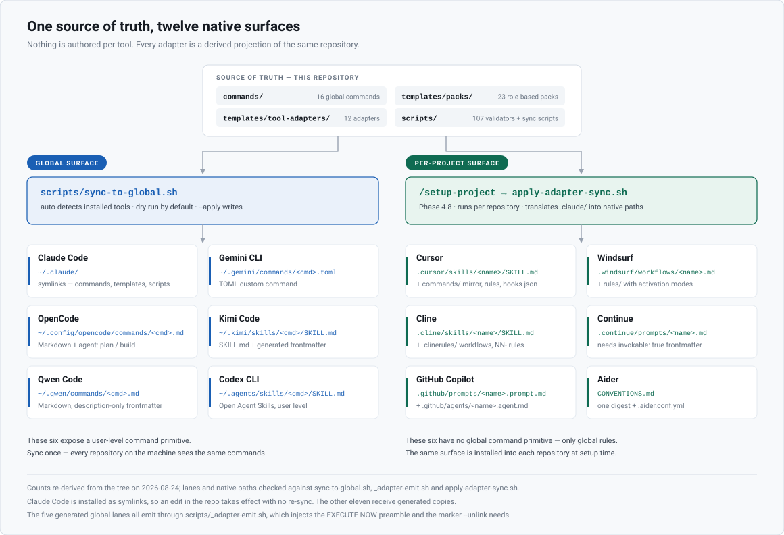
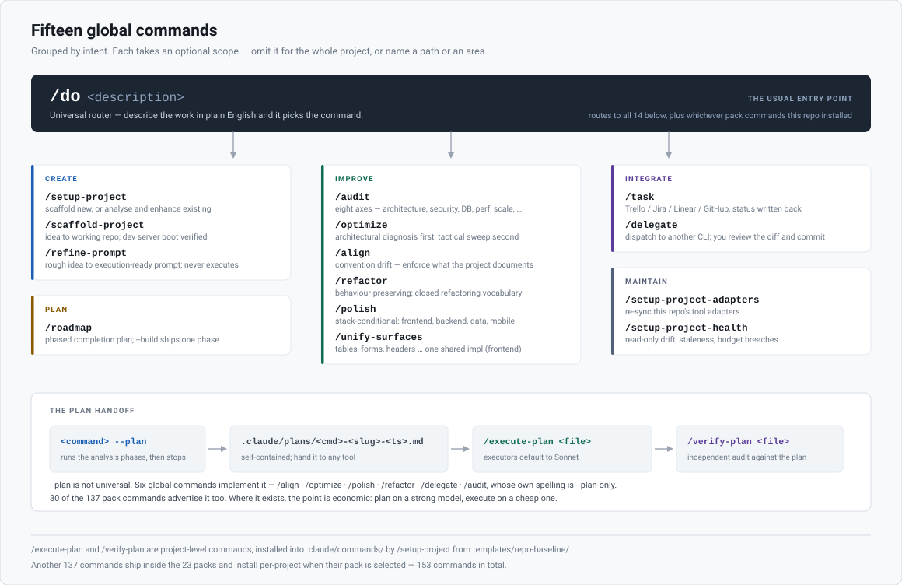
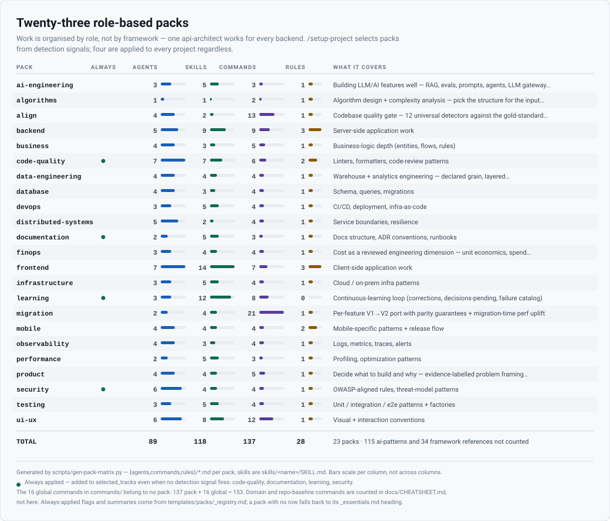

<div align="center">

# Refract

**Write your AI coding setup once. Run it in every tool.**

Refract is a portable engineering brain for AI coding agents. You maintain one source of truth —
commands, agents, rules, and 23 role-based knowledge packs — and it compiles itself into the
native format of every AI coding tool on your machine.

[](LICENSE)
[](#supported-tools)
[](#whats-inside)
[](#the-commands)
[](https://github.com/adnanmokhtar/refract/actions/workflows/quality-gates.yml)

</div>

---

## What goes wrong when you code with an agent

Five failure modes, and the command that exists for each. If none of these are familiar, you
probably don't need this.

### "It reinvented something we already have."

You have a `Button`. The agent writes a new one. You have a design token for that grey. It hardcodes
`#6b7280`. You have an error boundary. It writes a `catch {}` that swallows the error silently.

Nothing is *broken*, so nothing fails CI — the codebase just gets a little less coherent every week.

**→ `/align`** finds where the code drifted from conventions the project already has, and snaps it
back. It is deliberately not allowed to invent new conventions; that is a different job.

### "Something's wrong with this codebase, but I don't know what."

Is it the architecture? The queries? A missing index? An auth hole? Bundle size? You would have to
run five different audits and then decide which findings actually matter.

**→ `/audit`** scans eight axes in one pass — architecture, SOLID, security, database and runtime
performance, scalability, infrastructure, observability — then ranks everything by
*impact at your target scale × blast radius × fix cost*, so you fix the five that matter instead of
the ninety that don't.

### "This project is 70% finished and I've lost the map."

Half-wired features. Functions that `return null // TODO`. A settings page that saves to nothing. A
create flow with no delete. You know there is work left; you cannot see its shape.

**→ `/roadmap`** runs six detectors — stubs, dangling wires, feature asymmetry, spec delta, domain
table-stakes and dead-end flows —, then orders what is left into dependency-aware phases. It is
read-only until you ask it to build.

### "The agent has no taste, and no memory of ours."

Every session starts from zero. It does not know your layering rules, why you chose that queue, or
which module is load-bearing.

**→ `/setup-project`** reads the codebase and writes that knowledge down — conventions, entities,
architecture, hot paths, past failures — as files the agent loads every session. **23 role-based
packs** supply the expertise (backend, security, database, frontend, ui-ux, and 18 more) rather than
one generic prompt.

### "I set all this up. Then I opened Cursor."

Then Gemini CLI ships something interesting, a teammate swears by OpenCode, and your CI box only has
Aider. Every one of them wants your conventions in its own bespoke format.

So you copy-paste. Then the copies drift. Then you stop maintaining eleven of them.

**→ This is the part no other setup solves.** Refract keeps one source of truth and compiles it into
each tool's native format.

> Don't know which command you want? **`/do "the sidebar feels cramped"`** picks one for you.

## The idea

One repo is the source of truth. A single sync command refracts it into every tool's native
command surface, so `/audit` means the same thing whichever editor you happen to have open.



Two surfaces, because the tools genuinely differ:

- **Global** — tools with a user-level command primitive get the toolkit machine-wide, once.
- **Per-project** — tools with no global primitive (Cursor, Windsurf, Cline, Continue, Copilot,
  Aider) get the same surface installed into each repository at setup time, translated to their
  native shape.

Nothing is invented per tool. Every adapter is a derived projection of the same source.

---

## Quick start

**The install — clone and sync.** This is the real one: it puts the commands *and* the framework
tree they read where every tool can find them.

```bash
# 1. Clone somewhere stable — NOT at ~/.claude/
git clone https://github.com/adnanmokhtar/refract.git ~/Workspace/Projects/refract
cd ~/Workspace/Projects/refract

# 2. Preview what would change (dry run is the default — it writes nothing)
./scripts/sync-to-global.sh

# 3. Apply
./scripts/sync-to-global.sh --apply

# 4. Confirm the install is intact
./scripts/verify-sync.sh
```

Open any AI tool and type `/` — the commands are there. Installed tools are auto-detected; there are
no flags to pass. `--force` replaces stale real files, and `--unlink` cleanly removes everything
Refract owns.

**Just want a look first?** Claude Code can install it as a plugin in one line:

```
/plugin marketplace add adnanmokhtar/refract
/plugin install refract@refract
```

Be aware of what that route is and isn't. Commands arrive namespaced (`/refract:audit`, not
`/audit`), it reaches Claude Code only, and it does **not** install the `templates/` tree that
fourteen of the fifteen commands read by path — so `/refract:refine-prompt` works standalone and the
phase-driven ones like `/refract:setup-project` will not find their phase files. Treat the plugin as
a way to browse and try the light commands; treat the sync above as the install.

[docs/INSTALL.md](docs/INSTALL.md) compares all three routes, with the measured limits of each, and
[assets/terminal-sync.svg](assets/terminal-sync.svg) is a verbatim capture of a real sync run —
taken against a throwaway `HOME`, with its two rendering substitutions declared and a `Reproduce:`
line at the bottom.

> **Claude Code is installed as symlinks**, so editing a file in this repo takes effect
> immediately with no re-sync. The other tools receive generated copies — re-run
> `--apply` after you change a command.
>
> Your `~/.claude/settings.json` and `settings.local.json` are never touched. They stay yours.

---

## The commands

Fifteen global commands. Each takes an optional scope — omit it for the whole project, or pass a
path or a plain-English description of the area you mean.



| Command | What it does |
|---|---|
| `/do <description>` | **Universal router.** Describe what you want; it picks the right command. The one entry point you actually need to remember. |
| `/setup-project` | **The brain.** Scaffold a new project or analyse and enhance an existing one. Any stack, any shape. |
| `/scaffold-project` | Idea → working repo. Proposes a stack with rationale, runs the official scaffolders, layers architecture + auth + design system, verifies the dev server boots. |
| `/refine-prompt` | Turns a rough one-liner into an execution-ready prompt, then names the exact command to run it. Output only — never executes. |
| `/roadmap` | Phased completion plan for an unfinished project. Six detectors find every missing, stubbed and half-wired feature; `--build` ships one phase per run. |
| `/audit` | Full-stack engineering audit — architecture, SOLID, security, database and runtime performance, scalability, infrastructure, observability. Ranks by impact × blast radius × fix cost, then fixes in parallel waves. |
| `/optimize` | Architectural diagnosis first, tactical sweep second. Fixing the right layer dissolves dozens of downstream findings. |
| `/align` | Convention drift sweep — reinvented wrappers, silent catches, design-token drift, accessibility, i18n. |
| `/refactor` | Behaviour-preserving refactor using a closed vocabulary. No architectural moves, no scope creep. |
| `/polish` | Stack-conditional polish. Frontend → visual hierarchy, spacing, states, motion. Backend → API envelope, errors, pagination, idempotency. Data → schema consistency. Mobile → platform conventions. |
| `/unify-surfaces` | Makes every surface of the same type behave the same — tables, forms, headers, tabs, filters, buttons, validation. Frontend only. |
| `/task <ref>` | Pull one task from Trello, Jira, Linear or GitHub, execute it via `/do`, and write status back to the source. |
| `/delegate` | Dispatch one bounded task to a **different** AI CLI (Codex, Cursor, Aider, OpenCode…), then review its diff and commit it yourself. The relay never commits — that stays your call. |
| `/setup-project-adapters` | Re-sync tool adapters for the current repository. |
| `/setup-project-health` | Read-only health report — drift, staleness, budget breaches, missing ADRs. |

Another 133 commands ship inside the packs and install per-project when their pack is selected.

**Every command supports `--plan`**, which is where this gets economical: plan on a strong model,
execute on a cheap one.

```
/audit --plan                  # writes .claude/plans/<file>.md, then stops before editing
/execute-plan <plan-file>      # implements it (executor sub-agents default to Sonnet)
/verify-plan <plan-file>       # independently audits the result against the plan
```

The plan file is self-contained, so you can also hand it to Cursor, to Aider, or to a colleague.

---

## Supported tools

| Tool | Surface | Format |
|---|---|---|
| Claude Code | Global — `~/.claude/` | Symlinks (live, no re-sync) |
| Gemini CLI | Global — `~/.gemini/commands/` | `.toml` custom commands |
| OpenCode | Global — `~/.config/opencode/commands/` | Markdown + agent mode |
| Kimi Code | Global — `~/.kimi/skills/` | `SKILL.md` |
| Qwen Code | Global — `~/.qwen/commands/` | Markdown |
| Codex CLI | Global — `~/.agents/skills/` | Open Agent Skills |
| Cursor | Per project | `.cursor/commands/` |
| Windsurf | Per project | `.windsurf/workflows/` |
| Cline | Per project | `.clinerules/workflows/` |
| Continue | Per project | `.continue/prompts/` |
| GitHub Copilot | Per project | `.github/prompts/` |
| Aider | Per project | `CONVENTIONS.md` |

Adapters are version-tracked. Each records the upstream docs it was derived from plus a content
hash, and `scripts/check-tool-versions.sh` flags when a vendor changes its format so a human can
re-verify rather than silently shipping a broken translation.

---

## What's inside



| | |
|---|---|
| **23 packs** | Role-based knowledge tracks, not framework tracks |
| **88 agents** | Specialised reviewers and architects |
| **115 skills** | Reusable procedures, as `<name>/SKILL.md` |
| **148 commands** | 15 global + 133 pack-level |
| **35 domains** | auth, payment, multi-tenant, real-time, search, ledger, … |
| **12 adapters** | One per supported tool |
| **85 scripts** | Validators, linters, sync, search and audit tooling |
| **4 overlays** | GDPR · HIPAA · PCI-DSS · SOC 2 |

```
refract/
├── commands/                # the 15 global commands
├── templates/
│   ├── repo-baseline/       # copied into every new repository
│   ├── workspace-baseline/  # multi-repo workspaces (dispatcher, cross-repo commands)
│   ├── packs/               # 23 role-based tracks
│   ├── tracks/              # stack-specific scaffolders
│   ├── tool-adapters/       # per-tool translations
│   ├── phases/              # /setup-project's phase files
│   ├── domains/             # business-domain knowledge
│   └── regulatory-overlays/ # compliance overlays
├── benchmarks/              # seeded-defect fixtures + detection-rate harness
├── docs/                    # the manual, the reference, the cheatsheets
├── scripts/                 # validators, sync, verify, search, audit
└── tests/                   # fixtures for the validator harness
```

### Why role-based packs, not frameworks

Work is organised by **role**, not by framework. Framework specifics live as
`references/<framework>.md` inside each pack.

The payoff is that one `api-architect` agent works for every backend, and one `schema-architect`
works across Postgres, MySQL and Mongo. Adding a new framework means dropping in one reference
file — the agents adapt with no changes.

Meet a framework it has never seen? `/setup-project` writes the reference on the fly and every
future project reuses it.

### Finding things in 222k lines

The knowledge base is far larger than any context window, so Refract ships a lexical search layer —
`scripts/pack-search.py`, pure standard-library Python, no network:

```bash
$ python3 scripts/pack-search.py "multi-tenant data isolation leak"

35.03  agent    multi-tenant  templates/domains/multi-tenant/agents/tenant-isolation-reviewer.md
33.66  command  multi-tenant  templates/domains/multi-tenant/commands/tenant-leak-audit.md
30.80  rule     multi-tenant  templates/domains/multi-tenant/rules/multi-tenancy.md:72
```

It indexes over 5,000 row-shaped entries and answers in well under a second. Rows are **pointers,
not answers** — they cite the path to read, they do not replace the prose. Narrative discipline
files are deliberately left unindexed. See [docs/RETRIEVAL.md](docs/RETRIEVAL.md).

---

## `/setup-project` in practice

It works on empty folders and on decade-old codebases, and detects which case it is looking at.

```
/setup-project "Multi-tenant SaaS: NestJS API + Angular admin + Nuxt storefront, Stripe, multi-tenant"
/setup-project "Django + React + Postgres, GDPR-compliant CRM"
/setup-project "Go CLI that syncs DNS records — no database"
```

On an existing project it scans first, identifies gaps, proposes enhancements, and applies them
without overwriting your work. It always shows a plan and waits for approval before executing.

**Three modes, deliberately not redundant:**

| Mode | What it does | When to use it |
|---|---|---|
| `--enhance` | Adds missing files only; never touches existing ones | First pass on a half-configured project |
| `--refresh` | Backs up, extracts knowledge, regenerates from current templates | Pack version drift or structural upgrade |
| `--refine` | Round two — deepens existing artifacts against the real code | When round-one output feels generic |

**Domain tooling is generated from signals in your prompt.** Mention webhooks and you get
`/simulate-webhook` plus a signature-verification reviewer; mention multi-tenancy and you get
`/tenant-leak-audit`. Every strong signal gets at least one tool, and absent signals get nothing —
no speculative scaffolding.

### Round-two deepening

Round one anchors every artifact to surface signals. `--refine` then deepens them against the real
code through six extraction phases — entities, architecture, flows, emergent conventions, hot paths,
failure history — and re-anchors anything scoring below 70/100.

User-authored sections survive verbatim: they are marker-bracketed and SHA-256 verified. Runs are
idempotent and converge. Cost is capped with `--max-subagents=<N>`.

`--refine` does not stop at Claude Code. **Phase 4.8-DEEP** re-translates the deepened artifacts
into every selected adapter, so Cursor and OpenCode see the same round-two guidance. Each
per-adapter decision is logged to `.claude/_phase-4-8-decisions.md`.

Every run ends with a verdict: `PLATEAU-DEEP` (stop, it is as deep as the code supports),
`PLATEAU-WEAK` (grow the upstream signal first) or `NOT-PLATEAU` (run it again).

---

## Documentation

| Document | Read it when |
|---|---|
| [docs/INSTALL.md](docs/INSTALL.md) | Choosing between the plugin, the global sync, and per-project setup |
| [docs/COMMANDS.md](docs/COMMANDS.md) | You want the manual — every command, every flag, mode behaviours, flag conflicts |
| [docs/REFERENCE.md](docs/REFERENCE.md) | Something refused or surprised you — failure modes, discipline patterns, pitfalls |
| [docs/CHEATSHEET.md](docs/CHEATSHEET.md) | You want the one-page version |
| [docs/RETRIEVAL.md](docs/RETRIEVAL.md) | You want to query the knowledge base directly |
| [docs/FEATURE-LIFECYCLE.md](docs/FEATURE-LIFECYCLE.md) | You are taking a feature from idea to shipped |
| [docs/TASK-PROVIDERS.md](docs/TASK-PROVIDERS.md) | You are wiring `/task` to Trello, Jira, Linear or GitHub |
| [docs/AIDER-LOCAL-MODEL.md](docs/AIDER-LOCAL-MODEL.md) | You want to run this on a free local GGUF model |
| [CONTRIBUTING.md](CONTRIBUTING.md) | You want to add a pack, agent, rule or framework reference |

---

## Development

The framework has its own immune system. Doc-to-script drift and validators that silently regress
to always-pass are treated as build failures, not as someone's future problem.

```bash
bash scripts/test-validators.sh        # validator harness (good/bad fixtures)
bash tests/hooks/run.sh                # hook fixtures — guard-destructive, secret-scan, …
bash scripts/lint-tool-parity.sh       # adapter docs ⇄ registry ⇄ parity matrix
bash scripts/lint-validator-parity.sh  # every cited validator must actually exist
bash scripts/verify-doc-sync.sh        # docs ⇄ implementation
bash scripts/check-rule-budget.sh      # always-loaded rule budget
```

All of these run on every push and pull request via
[quality-gates.yml](.github/workflows/quality-gates.yml).

**Benchmarks.** `benchmarks/` ships fixture projects with deliberately seeded, documented defects so
detection rate can be measured rather than asserted. The harness is real; see
[benchmarks/RESULTS.md](benchmarks/RESULTS.md) for what has and has not been recorded so far.

**Extending it:** see [CONTRIBUTING.md](CONTRIBUTING.md). In short — a new agent drops into the
matching pack's `agents/`, a new framework is one `references/<framework>.md` file, and existing
projects never auto-upgrade, so a pull never changes how a working repository behaves.

---

## Troubleshooting

**Command not found** → the sync has not run, or it ran before the tool was installed. Check with
`ls ~/.claude/commands/`, then re-run `./scripts/sync-to-global.sh --apply`.

**`verify-sync.sh` reports drift** → something replaced a symlink with a real file, usually by
editing `~/.claude/` directly. Re-run with `--apply --force`.

**Hooks not running** → make them executable:
`chmod +x templates/repo-baseline/.claude/hooks/*.sh`

**Undo a scaffold** → delete `.claude/`, `ai/` and `CLAUDE.md` in the target project.
Everything else is yours.

**Start over completely** → `./scripts/sync-to-global.sh --unlink --apply` removes everything
Refract installed, and touches nothing else.

---

## Contributing

Issues and pull requests are welcome — start with [CONTRIBUTING.md](CONTRIBUTING.md). Please run the
gates above before opening a PR; they are fast, and they catch the drift class of bug that this
repository exists to prevent. Security reports go through [SECURITY.md](SECURITY.md).

## License

[MIT](LICENSE) © Adnan Mokhtar
